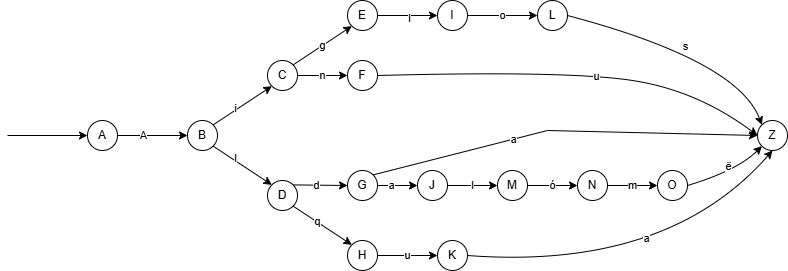

# Implementation of Lexical Analysis

## Overview

This project implements two distinct approaches to validating Elvish-inspired words:

1. **Prolog Dictionary**: A logic-based implementation using finite state automata to a set of words given from a small sample of Elvish Lord of the Rings words through explicit state transitions.
2. **Python Regex Validator**: A pattern-matching implementation using regular expressions to validate words against predefined patterns.

Both implementations serve the same purpose but showcase different programming paradigms and validation techniques.

## Table of Contents
- [Project Overview](#overview)
- [Prolog Implementation](#prolog-implementation)
  - [How It Works](#how-the-prolog-works)
  - [Usage](#prolog-usage)
  - [Time Complexity](#prolog-time-complexity)
- [Python Implementation](#python-implementation)
  - [How It Works](#how-the-python-works)
  - [Usage](#python-usage)
  - [Time Complexity](#python-time-complexity)
- [Comparison Between Implementations](#comparison-between-implementations)
- [Valid Words](#valid-words)
- [References](#references)

## Prolog Implementation

### A 

The Prolog implementation models a Nondeterministic Finite Automata (NFA) that explicitly defines transitions between states for each character in the input word:

Usually a deterministic finite automata DFA would have been simpler but there is a special
case here in this small dictionary between the words 'Alda' and 'Aldalome' where the word 'Alda'
could be a full valid word, but if there are letters after, may change that state. 
This means, there must be a state in which you have arrived the exact same way where the last
checker letter was 'a', and may be an accepted word or continue to check what's left.
The fact that there is more logic needed to decide what happens in this state implies multiplie
transition paths, while a DFA only allows 1 single path.

1. **Knowledge Base**:
   ```prolog
   move(a, b, 'A').
   move(b, c, 'i').
   move(b, d, 'l').
   move(c, e, 'g').
   move(c, f, 'n').
   move(d, g, 'd').
   move(d, h, 'q').
   move(e, i, 'l').
   move(i, l, 'o').
   move(l, z, 's').
   move(f, z, 'u').
   move(g, z, 'a').  % 'a' goes to z from g if it's the last letter
   move(g, j, 'a').  % 'a' goes to j from g if it's not the last letter
   move(j, m, 'l').
   move(m, n, 'ó').
   move(n, o, 'm').
   move(o, z, 'ë').
   move(h, k, 'u').
   move(k, z, 'a').
   ```
   This knowledge base defines all possible state transitions as facts in the form `move(FromState, ToState, Character)`, which can be visualized here:
   


2. **Accepting State**:
   ```prolog
   accept(z).
   ```
   Defines that state 'z' is the only accepting state, meaning any word that correctly reaches this state is valid.

3. **Character Encoding Fix**:
   ```prolog
   fix_char('ó', 'ó').
   fix_char(C, C).
   ```
   Handles potential character encoding issues, particularly with special characters.

4. **Word Processing Logic**:
   ```prolog
   % Base case - empty word at accepting state
   consult_dic([], CurrState) :-
       accept(CurrState), !.
   
   % Allow early termination
   consult_dic([], CurrState) :-
       move(CurrState, z, ''),
       accept(z), !.
   
   % Process each character
   consult_dic([Char1 | Rest], CurrState) :-
       % Special handling for 'a' in state 'g'
       (CurrState = g, Char1 = 'a' ->
           (Rest = [] -> 
               move(g, z, 'a');
               move(g, j, 'a')
           )
       ;
           move(CurrState, NewState, Char1)
       ),
       consult_dic(Rest, NewState).
   ```
   The core logic recursively processes each character and transitions between states, with special handling for context-sensitive cases.

### Prolog Usage

Run the Prolog file using a Prolog interpreter such as SWI-Prolog:

```bash
swipl my_quenya.pl

To test a set of predefined valid and non-valid words

?- run_tests.

To test individual words in an interactive session:

```prolog
?- consult_dic(['A','i','g','l','o','s'], a).
true.

?- consult_dic(['B','l','a'], a).
false.
```

### Prolog Time Complexity

- **State Transition Lookup**: O(1) due to Prolog's indexing on the first argument of facts
- **Word Processing**: O(n) where n is the input word length
- **Backtracking**: Mitigated by the cut operator (!) to prevent exponential behavior

## Python Implementation

### How the Python Works

The Python implementation uses regular expressions to match words against a predefined pattern:

1. **Regular Expression Pattern**: 
   ```python
   valid_pattern = re.compile(r'^(Aiglos|Ainu|Aid|Alg|Alq|Alo|Alda(lómë)?|Alqua?)$')
   ```
   This pattern directly encodes all valid word patterns, including optional components.

2. **Validation Function**:
   ```python
   def validate_word(word):
       return bool(valid_pattern.match(word))
   ```
   Returns a boolean indicating whether the word matches the pattern.

3. **Interactive CLI**:
   ```python
   def main():
       while True:
           print("\nChoose an option:")
           print("1. Test a list of valid words")
           print("2. Test a list of invalid words")
           print("3. Enter a custom word")
           print("4. Exit")
           
           # Menu handling code...
   ```
   Provides a user-friendly command-line interface for testing words.

### Python Usage

Run the script using Python:

```bash
python automata_regex.py
```

The program presents an interactive menu with these options:

1. **Test a list of valid words**: Tests predefined valid words
2. **Test a list of invalid words**: Tests predefined invalid words
3. **Enter a custom word**: Tests a user-provided word
4. **Exit**: Terminates the program

Example session:
```
Choose an option:
1. Test a list of valid words
2. Test a list of invalid words
3. Enter a custom word
4. Exit

Enter your choice: 1
Aiglos: True
Ainu: True
Alda: True
Aldalómë: True
Alqua: True
```

### Python Time Complexity

- **Pattern Matching**: O(n) where n is the length of the input string
- **Menu Operation**: O(1) per interaction
- **Batch Testing**: O(m × n) where m is the number of words and n is the average word length

## Valid Words

Both implementations validate the same set of Elvish-inspired words:
- Aiglos
- Ainu
- Alda
- Aldalómë
- Alqua

## References

### Prolog References
- [SWI-Prolog Documentation](https://www.swi-prolog.org/pldoc/doc_for?object=manual)
- [Finite State Machines in Prolog](https://www.metalevel.at/prolog/fsm)
- [Prolog Programming for Artificial Intelligence](https://www.amazon.com/Programming-Artificial-Intelligence-International-Computer/dp/0321417461) by Ivan Bratko

### Python References
- [Python Regular Expressions Documentation](https://docs.python.org/3/library/re.html)
- [Regular Expression Syntax](https://docs.python.org/3/library/re.html#regular-expression-syntax)
